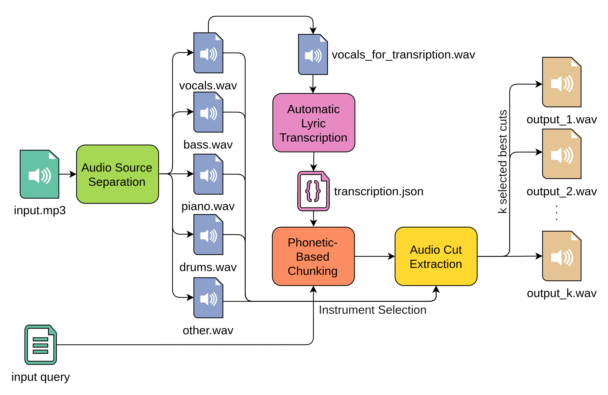
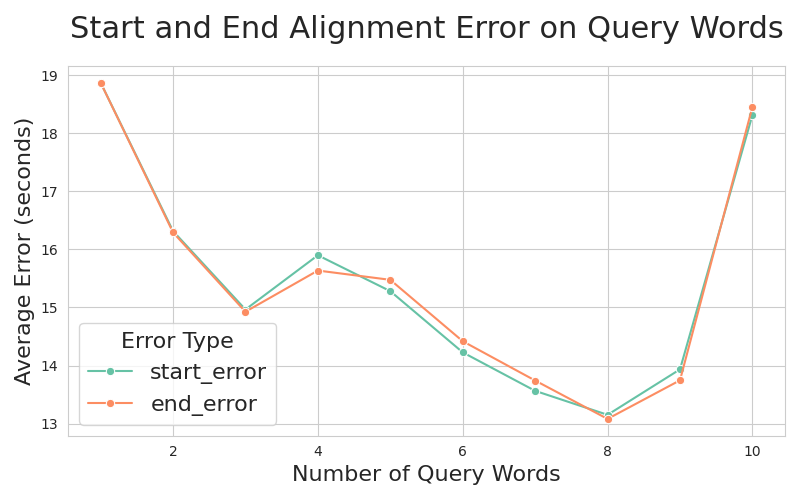
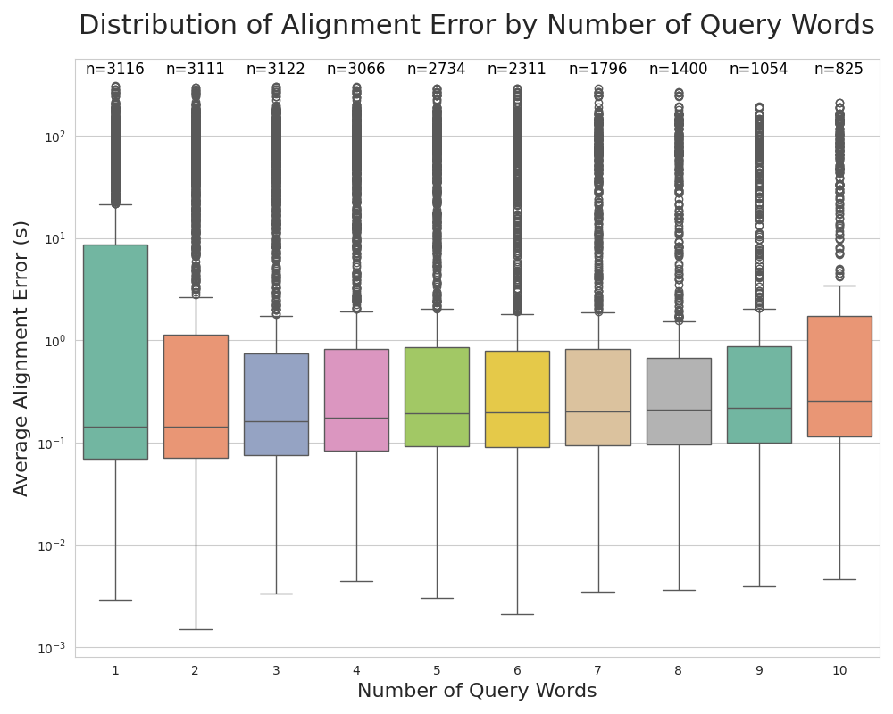
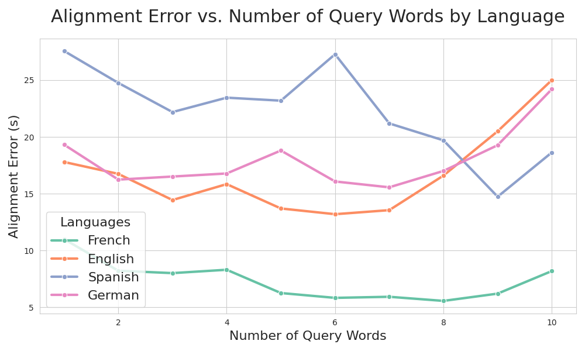
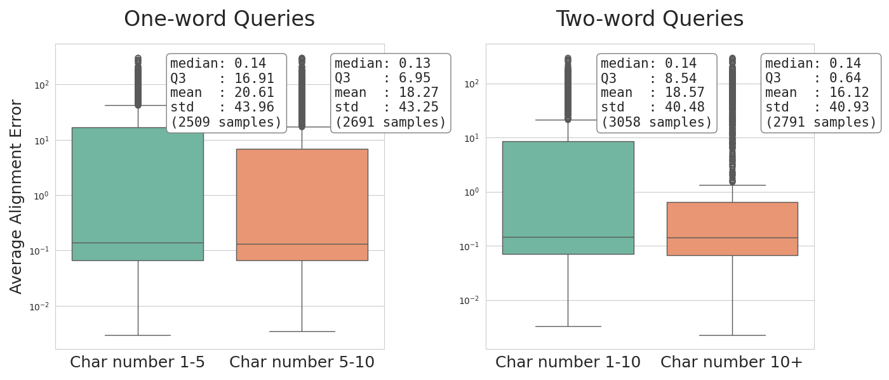
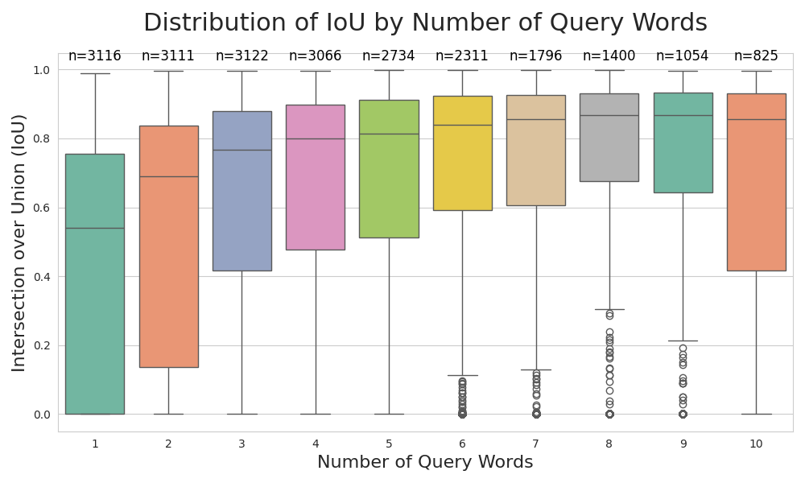
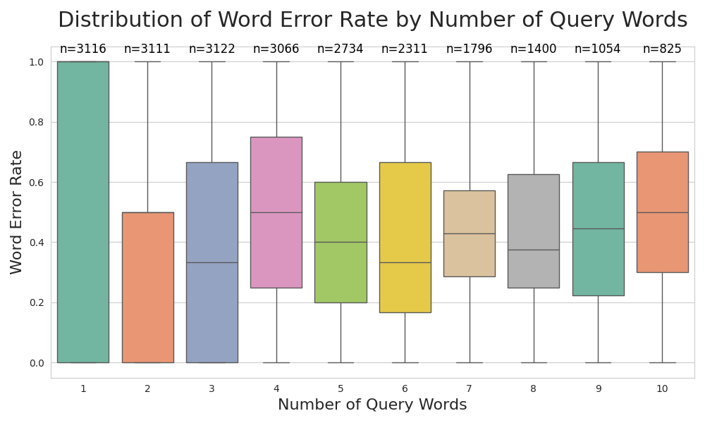

# Samplit 
## Phonetic-Based Audio Sampling via Source Separation and Transcription

<!-- Badges -->
     [](https://github.com/astral-sh/uv)

**Samplit** is a tool to automatically extract target-word-based audio segments from sung music using state-of-the-art transcription and source separation models and an original chunking phase based on phonetic similarity metrics.



## Table of Contents
- [About](#about)
  - [Thesis Abstract](#thesis-abstract)
- [Streamlit Web App](#streamlit-web-app)
- [Download](#download)
  - [Linux](#linux)
    - [External Dependencies](#external-dependencies)
  - [Windows](#windows)
    - [External Dependencies](#external-dependencies-1)
  - [Evaluation Dataset](#evaluation-dataset)
- [Results and Evaluation Plots](#results-and-evaluation-plots)


## About

Official implementation of my Bachelor's thesis project at Sapienza University of Rome.

> Tesi di Laurea Triennale. Sapienza University of Rome
> Facoltà di Scienze Matematiche, Fisiche e Naturali
> Scienze Matematiche per l’Intelligenza Artificiale

### Thesis Abstract
This paper explores the task of automatic audio sampling by proposing a pipeline that combines source separation and speech transcription. The project integrates state-of-the-art models for the main processing stages and introduces an original chunking phase based on phonetic similarity metrics.

The presented approach allows the extraction of audio segments from a vocal music track, given only the target words as input.

The results demonstrate good performance and highlight the potential for application in creative and audio production contexts.


## Streamlit Web App
To self-host the web application, run the following command
```sh
# linux
streamlit run src/samplit/streamlit_app.py

# windows
streamlit run src\samplit\streamlit_app.py
```


## Download
`Python 3.10.x` is required for this project.

### Linux
You can use **uv** to install the project dependencies automatically in a virtual environment:
```sh
uv sync
```
or you can use `pip` to manually install everything:
```sh
python -m venv .venv
source .venv/bin/activate
pip install -r requirements.txt
```
#### External Dependencies
Two external programs are required to make this project work:`ffmpeg` and `eSpeak-ng`.

Example download using apt:
```sh
sudo apt install ffmpeg espeak-ng
```


### Windows
Since committed `uv.lock` file is linux only, you can use `uv pip` or just `pip` to install requirements:
```sh
uv venv
.venv\Scripts\activate
uv pip install -r requirements.txt
```
or using just pip:
```
python -m venv .venv
.venv\Scripts\activate
pip install -r requirements.txt
```

#### External Dependencies
Two external programs are required to make this project work: `ffmpeg` and `eSpeak-ng`. On windows you have to manually install them from the official websites; respectively:
1. https://ffmpeg.org/
2. https://github.com/espeak-ng/espeak-ng/releases

> Note:
> On windows there are some possible path issues using eSpeak-ng, as explained in the following link: https://bootphon.github.io/phonemizer/install.html.

After installing, ensure you set the correct DLL path in the `src/samplit/data/strings.py` script. The default value is:

```python
ESPEAK_NG_DLL: str = "C:\Program Files\eSpeak NG\libespeak-ng.dll"
```

### Evaluation Dataset
**JamendoLyrics** dataset (https://github.com/f90/jamendolyrics) was used for the evaluation part, for the hyperparameter tuning and grid search to find respectively the best transcription model and the best similarity weights.


## Results and Evaluation Plots
Summary of the evaluation analysis, which is discussed in more detail in the thesis paper.
- Best Transcription Model: **Whisper "medium"**
- Best Similarity Weights:
  1. 0.35 (pretrained embeddings cosine similarity)
  2. 0.50 (*phonetic similarity*)
  3. 0.15 (transcription model's confidence)






